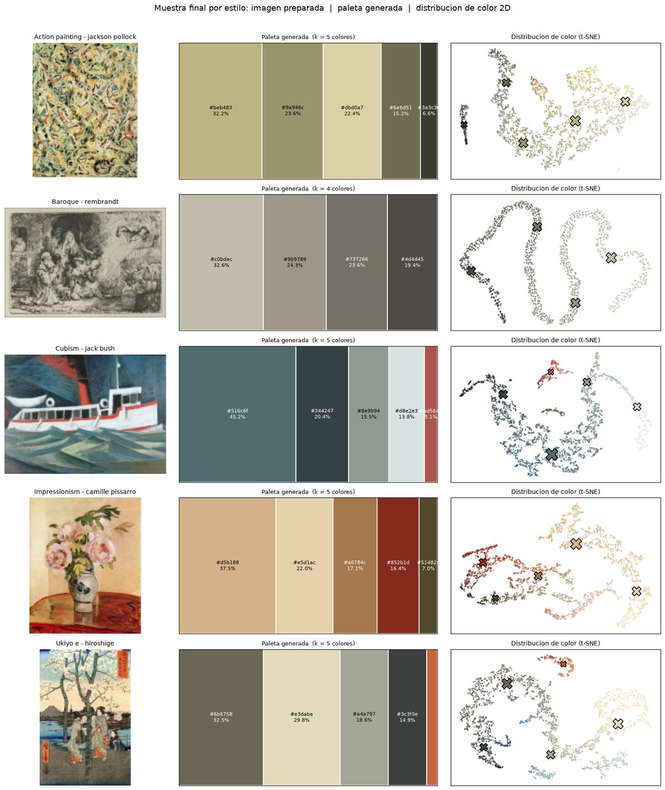
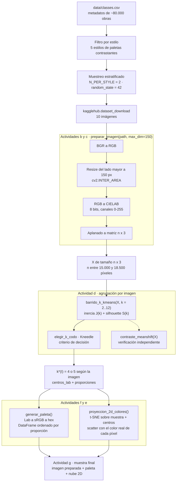
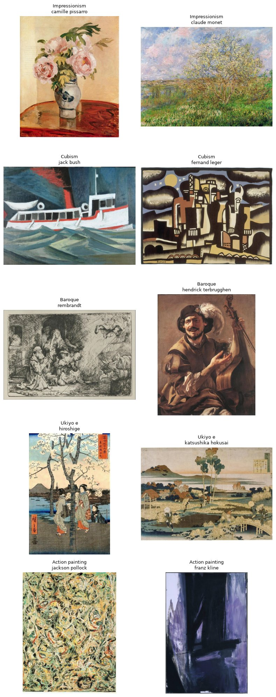
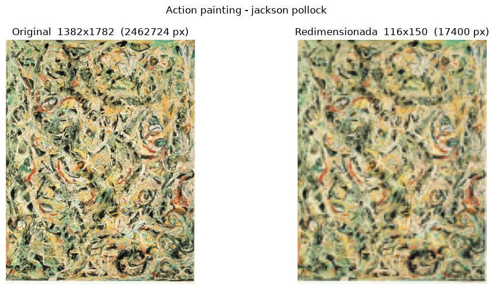
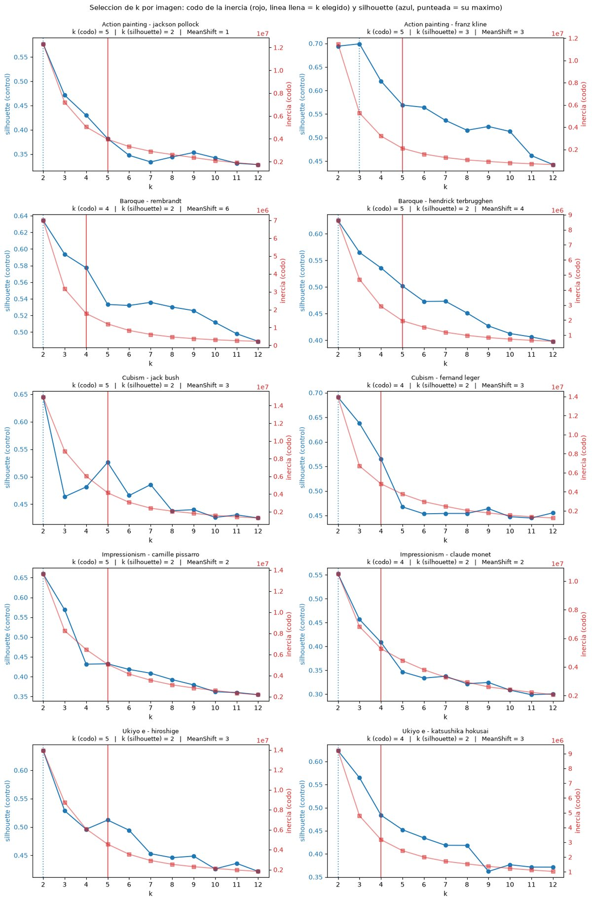
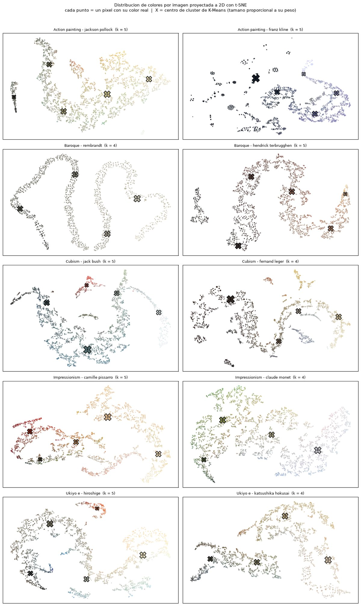
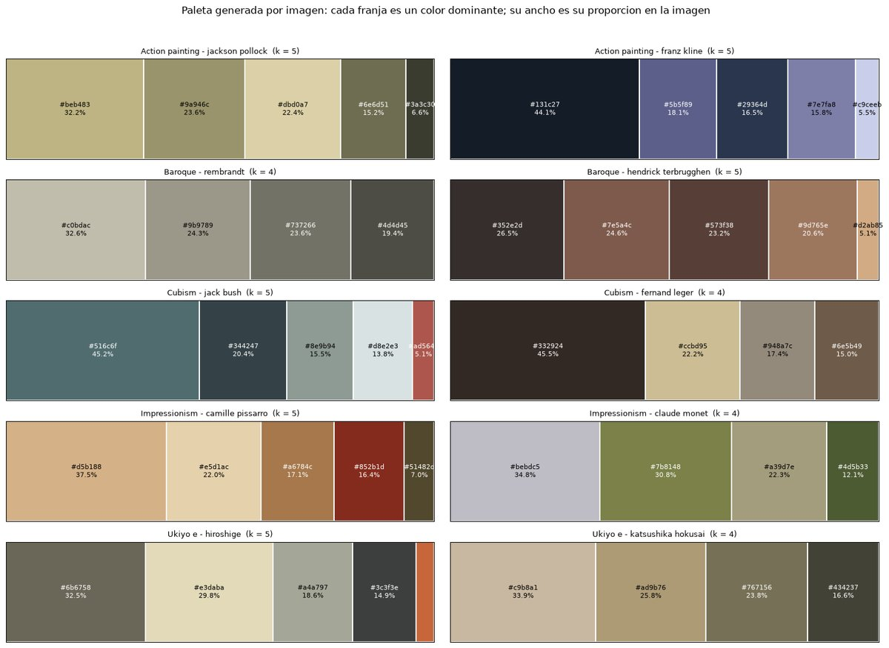

# Microproyecto 1 — Paleta de colores con Machine Learning No Supervisado

Proyecto del curso **Machine Learning No Supervisado** (Maestría en Inteligencia Artificial).

Extracción automática de los **tonos dominantes** de una obra de arte mediante *clustering* de sus píxeles en el espacio de color CIELAB, con el número de colores (`k`) **recalculado individualmente para cada imagen**, y generación de un muestrario (paleta) reutilizable junto con una visualización 2D de la distribución de color.

---

## Tabla de contenido

- [Objetivo y caso de uso](#objetivo-y-caso-de-uso)
- [Resultado en una imagen](#resultado-en-una-imagen)
- [Dataset](#dataset)
- [Estructura del repositorio](#estructura-del-repositorio)
- [Arquitectura del método](#arquitectura-del-método)
- [(a) Selección del conjunto de imágenes](#a-selección-del-conjunto-de-imágenes)
- [(b) y (c) Preparación de imágenes y pipeline](#b-y-c-preparación-de-imágenes-y-pipeline)
- [(d) Modelo de agrupación por imagen](#d-modelo-de-agrupación-por-imagen)
- [(e) Visualización 2D de la distribución de colores](#e-visualización-2d-de-la-distribución-de-colores)
- [(f) Función de generación de la paleta](#f-función-de-generación-de-la-paleta)
- [(g) Muestra final](#g-muestra-final)
- [Resumen de hiperparámetros](#resumen-de-hiperparámetros)
- [Costo computacional](#costo-computacional)
- [Limitaciones y trabajo futuro](#limitaciones-y-trabajo-futuro)
- [Instalación y configuración del entorno](#instalación-y-configuración-del-entorno)
- [Cómo ejecutar el notebook](#cómo-ejecutar-el-notebook)
- [Entregable y rúbrica](#entregable-y-rúbrica)
- [Equipo](#equipo)

---

## Objetivo y caso de uso

Desarrollar un método, basado en técnicas de agrupación (clustering), que permita extraer los tonos dominantes de una imagen y generar un muestrario (paleta) de los colores representativos presentes en ella. El caso de uso motivador es una herramienta automática de utilidad para diseñadores gráficos, directores de arte, pintores y creadores de contenido, entre otras aplicaciones (marketing, psicología, medicina, estudios ambientales).

Formalmente, dada una imagen $I \in \{0,\dots,255\}^{H \times W \times 3}$, el método produce:

$$\text{Paleta}(I) = \{(c_1, p_1), (c_2, p_2), \dots, (c_k, p_k)\}, \qquad \sum_{j=1}^{k} p_j = 1$$

donde $c_j \in \mathbb{R}^3$ es un color dominante (centro de cluster), $p_j$ su proporción de píxeles en la imagen, y **$k = k(I)$ se determina por imagen**, no como constante global.

---

## Resultado en una imagen

Salida final del método para un representante de cada estilo: imagen preparada, paleta generada y distribución de color en 2D.



---

## Dataset

Se usa **WikiArt** (dataset [`steubk/wikiart`](https://www.kaggle.com/datasets/steubk/wikiart) en Kaggle), un conjunto de obras de arte de distintos estilos/corrientes pictóricas.

- `data/classes.csv`: metadatos de ~80.000 obras, con columnas `filename, artist, genre, description, phash, width, height, genre_count, subset`. `genre` es una lista (como string) de estilos aplicables a cada obra; se parsea con `ast.literal_eval` y se toma el primer elemento como columna `style`.
- Las imágenes **no** se descargan completas al repo: se obtienen bajo demanda con [`kagglehub`](https://github.com/Kaggle/kagglehub) (`kagglehub.dataset_download(DATASET, path=filename)`), que las cachea localmente fuera del repo (por defecto en `~/.cache/kagglehub`).

### Credenciales de Kaggle

`kagglehub` necesita credenciales de la API de Kaggle para descargar el dataset:

1. Crear una cuenta en [kaggle.com](https://www.kaggle.com) si no se tiene.
2. En *Account → API → Create New Token* descargar `kaggle.json`.
3. Colocarlo en `~/.kaggle/kaggle.json` (Linux/Mac) o `C:\Users\<usuario>\.kaggle\kaggle.json` (Windows), o exportar `KAGGLE_USERNAME` y `KAGGLE_KEY` como variables de entorno.

---

## Estructura del repositorio

```
Proyecto1MLNS/
├── data/
│   └── classes.csv                             # metadatos del dataset WikiArt
├── notebooks/
│   └── microproyecto1_paleta_colores.ipynb     # notebook principal (toda la lógica)
├── reports/
│   ├── microproyecto1_paleta_colores.html      # export del notebook (entregable)
│   └── figures/                                # figuras extraídas, usadas en este README
├── requirements.txt
├── CLAUDE.md
├── PLAN.md
└── README.md
```

Toda la lógica (preprocesamiento, clustering, generación de paleta, visualización) vive **dentro del notebook**: el entregable son solo el `.ipynb` y su `.html`, así que no hay módulos `.py` auxiliares.

---

## Arquitectura del método



---

## (a) Selección del conjunto de imágenes

**Criterio.** Se eligieron 5 estilos con paletas e identidad visual claramente distintas, para poner a prueba el método sobre casos cromáticamente variados:

| Estilo | Característica cromática esperada |
|---|---|
| **Baroque** | tonos oscuros y dramáticos (claroscuro), marrones y dorados |
| **Impressionism** | paleta luminosa y difusa, pasteles y pinceladas de luz |
| **Cubism** | paleta geométrica y apagada, tonos tierra y grises |
| **Ukiyo e** | colores planos y muy saturados (grabado japonés) |
| **Action painting** | abstracción con contrastes fuertes (blancos, negros, primarios) |

Se **excluyó Romanticism** del conjunto original de 6 estilos por solapar su paleta cálida y dramática con la de Baroque: dado el límite de 6–10 imágenes, se prioriza maximizar la diversidad cromática entre clases.

**Muestreo.** Estratificado por estilo, `N_PER_STYLE = 2`, `random_state = 42`:

```python
selected = (df[df["style"].isin(styles)]
              .groupby("style", group_keys=False)
              .sample(n=N_PER_STYLE, random_state=42))
```

**Conjunto resultante (10 imágenes, dentro del rango 6–10 de la rúbrica, con 5 estilos, por encima del mínimo de 3):**

| # | Estilo | Artista | Obra |
|---|---|---|---|
| 1 | Action painting | Jackson Pollock | *Eyes in the Heat* (1946) |
| 2 | Action painting | Franz Kline | *Torches Mauve* (1960) |
| 3 | Baroque | Rembrandt | *Angel Departing from the Family of Tobias* (1641) |
| 4 | Baroque | Hendrick Terbrugghen | *A Laughing Bravo with a Bass Viol and a Glass* |
| 5 | Cubism | Jack Bush | *Ferry at Bigwin Island* (1952) |
| 6 | Cubism | Fernand Léger | *The Creation of the World* |
| 7 | Impressionism | Camille Pissarro | *Pink Peonies* (1873) |
| 8 | Impressionism | Claude Monet | *Springtime* |
| 9 | Ukiyo e | Hiroshige | *Cherry Tree* |
| 10 | Ukiyo e | Katsushika Hokusai | *Peasants in Autumn* |



---

## (b) y (c) Preparación de imágenes y pipeline

Encapsulado en la función reutilizable `preparar_imagen(path, max_dim=150) -> (img_rgb, pixeles_lab)`.

### Paso 1 — Orden de canales: BGR a RGB

OpenCV lee en BGR. Se convierte a RGB para que las visualizaciones de Matplotlib muestren los colores reales y para partir de una convención estándar antes de pasar a Lab.

### Paso 2 — Redimensionado al lado mayor `max_dim = 150` px, interpolación por área

Escala aplicada (solo reduce, nunca amplía):

$$s = \frac{\text{max\_dim}}{\max(H, W)}, \qquad \text{si } s < 1: \quad (H', W') = (\text{round}(sH),\ \text{round}(sW))$$

`cv2.INTER_AREA` calcula cada píxel destino como el **promedio del área fuente** que le corresponde:

$$I'(u,v) = \frac{1}{|R_{uv}|} \sum_{(x,y) \in R_{uv}} I(x,y)$$

A diferencia de las interpolaciones bicúbica o de Lanczos —que aplican núcleos con lóbulos negativos y pueden generar *overshoot*, es decir colores que no existían en la obra— el promediado por área produce colores que son combinaciones convexas de los originales. La paleta resultante no se contamina con tonos inventados.

**Efecto medido:** de $\sim 2{,}5 \times 10^6$ píxeles a $\sim 1{,}6 \times 10^4$, una reducción de **~2 órdenes de magnitud** que hace viable correr 11 ajustes de K-Means por imagen.

| Estilo | Original | Preparada | Píxeles | Archivo |
|---|---|---|---|---|
| Action painting | 1782×1382 | 150×116 | 17.400 | `jackson-pollock_eyes-in-the-heat-1946(2).jpg` |
| Action painting | 2037×1382 | 150×102 | 15.300 | `franz-kline_torches-mauve-1960.jpg` |
| Baroque | 1382×2035 | 102×150 | 15.300 | `rembrandt_angel-departing-...-1641.jpg` |
| Baroque | 1705×1382 | 150×122 | 18.300 | `hendrick-terbrugghen_a-laughing-bravo-....jpg` |
| Cubism | 1382×1867 | 111×150 | 16.650 | `jack-bush_ferry-at-bigwin-island-1952.jpg` |
| Cubism | 1382×1873 | 111×150 | 16.650 | `fernand-leger_the-creation-of-the-world.jpg` |
| Impressionism | 1685×1382 | 150×123 | 18.450 | `camille-pissarro_pink-peonies-1873.jpg` |
| Impressionism | 1382×1834 | 113×150 | 16.950 | `claude-monet_springtime-1.jpg` |
| Ukiyo e | 2065×1382 | 150×100 | 15.000 | `hiroshige_cherry-tree.jpg` |
| Ukiyo e | 1382×1961 | 106×150 | 15.900 | `katsushika-hokusai_peasants-in-autumn.jpg` |

**Verificación de que el resize no distorsiona la paleta.** Para la primera imagen del conjunto:

| | R | G | B |
|---|---|---|---|
| original (2,46 M px) | 168,0 ± 66,2 | 159,7 ± 61,5 | 119,5 ± 56,8 |
| reducida (17,4 K px) | **168,0** ± 48,8 | **159,7** ± 43,2 | **119,5** ± 38,1 |

La **media por canal se conserva exactamente** (la tendencia central de cada color no se mueve) y la desviación estándar baja porque `INTER_AREA` promedia píxeles vecinos y atenúa la textura fina de pincelada. Para el clustering de color esto no es un problema —incluso ayuda—: los centros dependen de dónde se concentra la masa de píxeles, no de la varianza local.



### Paso 3 — Conversión a CIELAB

K-Means y MeanShift agrupan minimizando **distancia euclidiana**. En sRGB la distancia euclidiana no se corresponde con la diferencia de color percibida. CIELAB está diseñado para ser aproximadamente *perceptualmente uniforme*, de modo que la diferencia de color CIE76 es simplemente la distancia euclidiana:

$$\Delta E^{*}_{ab} = \sqrt{(\Delta L^{*})^2 + (\Delta a^{*})^2 + (\Delta b^{*})^2}$$

Agrupar en Lab produce, por tanto, clusters que se corresponden con "colores que una persona agruparía". La cadena de conversión (iluminante D65) es:

**1. Linealización de sRGB** (deshacer la gamma), para cada canal $C \in \{R,G,B\}$ normalizado a $[0,1]$:

$$C_{lin} = \begin{cases} \dfrac{C}{12{,}92} & C \le 0{,}04045 \\ \left(\dfrac{C + 0{,}055}{1{,}055}\right)^{2{,}4} & C > 0{,}04045 \end{cases}$$

**2. sRGB lineal a XYZ:**

$$\begin{bmatrix} X \\ Y \\ Z \end{bmatrix} = \begin{bmatrix} 0{,}4124 & 0{,}3576 & 0{,}1805 \\ 0{,}2126 & 0{,}7152 & 0{,}0722 \\ 0{,}0193 & 0{,}1192 & 0{,}9505 \end{bmatrix} \begin{bmatrix} R_{lin} \\ G_{lin} \\ B_{lin} \end{bmatrix}$$

**3. XYZ a Lab**, con blanco de referencia $(X_n, Y_n, Z_n) = (0{,}9505,\ 1{,}0000,\ 1{,}0890)$ y

$$f(t) = \begin{cases} t^{1/3} & t > (6/29)^3 \\ \dfrac{1}{3}\left(\dfrac{29}{6}\right)^{2} t + \dfrac{4}{29} & \text{en otro caso} \end{cases}$$

$$L^{*} = 116\,f\!\left(\tfrac{Y}{Y_n}\right) - 16, \qquad a^{*} = 500\left[f\!\left(\tfrac{X}{X_n}\right) - f\!\left(\tfrac{Y}{Y_n}\right)\right], \qquad b^{*} = 200\left[f\!\left(\tfrac{Y}{Y_n}\right) - f\!\left(\tfrac{Z}{Z_n}\right)\right]$$

**Codificación de 8 bits de OpenCV.** `cv2.COLOR_RGB2LAB` sobre un arreglo `uint8` no devuelve $L^{*} \in [0,100]$ y $a^{*}, b^{*} \in [-128,127]$, sino la versión escalada a byte:

$$L_{8} = \frac{255}{100}\,L^{*}, \qquad a_{8} = a^{*} + 128, \qquad b_{8} = b^{*} + 128$$

Es decir, los tres canales quedan en $[0, 255]$ con **128 como neutro** en $a$ y $b$. Este detalle importa: es lo que hace que los tres canales compartan rango y justifica no normalizar.

### Paso 4 — Aplanado a matriz $(n_{\text{píxeles}}, 3)$

Cada píxel se trata como una muestra independiente $x_i = (L_i, a_i, b_i)$. Se **descarta la posición** $(x, y)$: el objetivo es agrupar colores, no regiones espaciales de la imagen.

### Decisión: no se estandariza ni se normaliza

Los tres canales de Lab de 8 bits ya comparten el rango $[0,255]$ y tienen significado perceptual homogéneo, así que ninguno domina artificialmente la distancia. Aplicar z-score por canal ($x' = (x - \mu)/\sigma$) **deformaría precisamente las distancias perceptuales** que motivaron elegir Lab: reescalaría $\Delta L$, $\Delta a$ y $\Delta b$ por factores distintos y rompería la equivalencia con $\Delta E^{*}_{ab}$. Escalar a $[0,1]$ tampoco aporta nada porque el rango ya es común. Los píxeles Lab se pasan tal cual al modelo.

---

## (d) Modelo de agrupación por imagen

**Esta es la actividad de mayor peso de la rúbrica (30%) y su requisito central es que `k` se recalcule para cada imagen.**

### Modelo principal: K-Means

Para cada imagen se ajusta K-Means sobre sus píxeles Lab, minimizando la **inercia** (suma de distancias al cuadrado intra-cluster):

$$J(k) = \sum_{j=1}^{k} \sum_{x_i \in C_j} \lVert x_i - \mu_j \rVert_{2}^{2}, \qquad \mu_j = \frac{1}{|C_j|}\sum_{x_i \in C_j} x_i$$

Se usa la inicialización `k-means++` (que elige cada centro siguiente con probabilidad proporcional a $D(x)^2$, la distancia al centro más cercano ya elegido), con `n_init = 10` reinicios y `random_state = 42`. K-Means es el método principal porque es rápido, reproducible y su único hiperparámetro relevante es `k`: eso convierte la elección de `k` en una búsqueda de hiperparámetro limpia y auditable.

El barrido cubre $k \in \{2, 3, \dots, 12\}$ para **cada una** de las 10 imágenes (110 ajustes en total).

### Criterio de decisión: método del codo (Kneedle)

Se toma el `k` del "codo" de la curva de inercia: el punto de rendimientos decrecientes, donde añadir un cluster más ya casi no reduce la distorsión. Para localizarlo de forma objetiva (sin inspección visual) se usa el método **Kneedle**: se normalizan ambos ejes a $[0,1]$,

$$\tilde{x}_i = \frac{k_i - k_{\min}}{k_{\max} - k_{\min}}, \qquad \tilde{y}_i = \frac{J(k_i) - J_{\min}}{J_{\max} - J_{\min}}$$

se traza la recta que une el primer y el último punto de la curva,

$$L(\tilde{x}) = \tilde{y}_1 + (\tilde{y}_n - \tilde{y}_1)\,\tilde{x}$$

y el codo es el `k` de **máxima distancia vertical** a esa recta:

$$k^{*} = \arg\max_{i} \; \left[\, L(\tilde{x}_i) - \tilde{y}_i \,\right]$$

Como la curva de inercia es convexa y decreciente, queda por debajo de la cuerda y la diferencia $L(\tilde{x}_i) - \tilde{y}_i$ es positiva; su máximo es el punto de mayor curvatura. Este es el criterio adecuado para extraer una paleta: busca **el `k` más pequeño que ya captura la variación de color** de la imagen.

### Métrica de verificación: silhouette

Para cada punto $i$, con $a(i)$ = distancia media a los puntos de su propio cluster y $b(i)$ = distancia media mínima a otro cluster:

$$s(i) = \frac{b(i) - a(i)}{\max\{a(i),\, b(i)\}} \in [-1, 1], \qquad S(k) = \frac{1}{n}\sum_{i=1}^{n} s(i)$$

Se evaluó como criterio primario y se **descartó**: colapsa a $k = 2$ en 9 de las 10 imágenes. El silhouette premia particiones de pocos clusters muy separados —típicamente el eje claro/oscuro de la obra— y no la granularidad cromática que necesita una paleta. Se conserva como **control**: un silhouette claramente positivo en el `k` del codo confirma que la partición elegida tiene estructura real. Se calcula sobre una submuestra de `SAMPLE_SILHOUETTE = 2000` píxeles porque es $O(n^2)$ en tiempo y memoria.

### Contraste independiente: MeanShift

MeanShift no recibe `k`: lo deduce de los modos de la densidad, desplazando iterativamente cada punto hacia la media local ponderada por un núcleo $K$ de ancho `bandwidth` $h$:

$$m(x) = \frac{\sum_{i} K\!\left(\frac{x - x_i}{h}\right) x_i}{\sum_{i} K\!\left(\frac{x - x_i}{h}\right)} \; - \; x$$

El `bandwidth` se estima **por imagen** con `estimate_bandwidth(quantile=0.2, n_samples=500)`, que toma el cuantil 0,2 de las distancias entre pares de una submuestra. Corre sobre `SAMPLE_MEANSHIFT = 3000` píxeles ($O(n^2)$ por iteración). Si el número de clusters que encuentra acompaña al `k` del codo, refuerza que ese `k` no es un artefacto de K-Means.

### Resultados por imagen

| Estilo / obra | **k (codo)** | k (silhouette) | silhouette @ codo | MeanShift | bandwidth |
|---|:--:|:--:|--:|:--:|--:|
| Action painting — Pollock | **5** | 2 | 0,382 | 1 | 24,47 |
| Action painting — Kline | **5** | 3 | 0,569 | 3 | 21,21 |
| Baroque — Rembrandt | **4** | 2 | 0,577 | 6 | 15,75 |
| Baroque — Terbrugghen | **5** | 2 | 0,502 | 4 | 15,90 |
| Cubism — Jack Bush | **5** | 2 | 0,526 | 3 | 29,99 |
| Cubism — Léger | **4** | 2 | 0,565 | 3 | 24,05 |
| Impressionism — Pissarro | **5** | 2 | 0,433 | 2 | 26,94 |
| Impressionism — Monet | **4** | 2 | 0,409 | 2 | 23,49 |
| Ukiyo e — Hiroshige | **5** | 2 | 0,512 | 3 | 28,14 |
| Ukiyo e — Hokusai | **4** | 2 | 0,484 | 3 | 21,87 |

**Rango de `k` elegido: 4 a 5. No hay un `k` fijo único para todas las imágenes.**



### Lectura de resultados

- **`k` se recalcula por imagen.** El criterio del codo da 4 o 5 según la obra. El rango es estrecho porque, a 150 px, estas diez obras tienen una complejidad de color efectiva parecida y la curva de inercia baja de forma suave; el mismo procedimiento sobre una imagen casi monocroma elegiría un `k` menor.
- **El silhouette confirma estructura, pero no fija `k`.** En el `k` del codo va de **0,382 a 0,577** (claramente positivo: los clusters están separados). Su máximo, en cambio, está en $k = 2$ en 9 de 10 casos.
- **MeanShift acompaña.** Sin recibir `k`, encuentra entre 2 y 6 clusters en 9 de 10 imágenes, en el mismo orden de magnitud que el codo. La excepción es el Pollock *Eyes in the Heat*, donde el `bandwidth` estimado (24,47) resulta demasiado grande y colapsa todo en 1 cluster: es la conocida hipersensibilidad de MeanShift al `bandwidth`, y la razón por la que se usa como contraste y no como método principal.

---

## (e) Visualización 2D de la distribución de colores

Cada imagen preparada es una nube de píxeles en CIELAB (3D). Para *ver* cómo se distribuyen esos colores y cómo los agrupa K-Means, se proyecta la nube a 2D con **t-SNE**.

### Por qué t-SNE y no PCA

t-SNE preserva la estructura **local**. Modela la similitud entre puntos en alta dimensión con probabilidades condicionales gaussianas

$$p_{j|i} = \frac{\exp\!\left(-\lVert x_i - x_j \rVert^2 / 2\sigma_i^2\right)}{\sum_{l \ne i}\exp\!\left(-\lVert x_i - x_l \rVert^2 / 2\sigma_i^2\right)}, \qquad p_{ij} = \frac{p_{j|i} + p_{i|j}}{2n}$$

y en el plano con un núcleo t de Student de 1 grado de libertad (colas pesadas, que mitigan el *crowding problem*)

$$q_{ij} = \frac{\left(1 + \lVert y_i - y_j \rVert^2\right)^{-1}}{\sum_{k \ne l}\left(1 + \lVert y_k - y_l \rVert^2\right)^{-1}}$$

minimizando la divergencia de Kullback-Leibler por descenso de gradiente:

$$C = \mathrm{KL}(P \, \Vert \, Q) = \sum_{i \ne j} p_{ij} \log \frac{p_{ij}}{q_{ij}}$$

Así, píxeles de color parecido quedan cerca y los grupos densos se separan visualmente, que es justo lo que interesa mostrar. PCA daría una proyección lineal sobre las dos direcciones de mayor varianza, más fiel a las distancias globales pero con tendencia a solapar grupos que en Lab sí están separados.

**Advertencia de lectura:** en un mapa t-SNE las distancias absolutas y los tamaños de los grupos **no son cuantitativos**; solo es fiable la vecindad (qué está cerca de qué). Es una visualización exploratoria, no una medida.

### Hiperparámetros

- **`SAMPLE_TSNE = 3000` píxeles** por imagen (`random_state=42`). t-SNE es $O(n^2)$; los ~16.000 píxeles por imagen son demasiados y 3.000 bastan para ver la forma de la distribución.
- **`perplexity = 30`** (valor por defecto de scikit-learn). La perplejidad es la entropía exponenciada de la distribución de vecindad de cada punto,

  $$\mathrm{Perp}(P_i) = 2^{H(P_i)}, \qquad H(P_i) = -\sum_j p_{j|i} \log_2 p_{j|i}$$

  es decir, el número efectivo de vecinos que considera cada punto; $\sigma_i$ se ajusta por búsqueda binaria para alcanzarla. Se aplica además la cota de scikit-learn $\text{perplexity} < n/3$ por seguridad.
- **`init="pca"`** para una inicialización estable y reproducible.

### Cómo se colorea y cómo se sitúan los centros

Cada punto se pinta con **su color RGB real** (revirtiendo Lab a RGB con `lab_a_rgb`), de modo que el gráfico es literalmente la nube de colores de la obra. Se prefiere esto a colorear por id de clúster con una paleta categórica arbitraria: como K-Means agrupa *en el espacio de color*, cada clúster ya es una región de color coherente, y pintar por color real muestra a la vez la distribución y la partición.

Los centros se superponen como marcador `X` de tamaño proporcional a su peso ($60 + 700\,p_j$ puntos). Como **t-SNE no tiene método `transform`** (no puede proyectar puntos nuevos sobre un embedding ya ajustado), se corre una sola vez sobre la pila

$$\begin{bmatrix} X_{\text{muestra}} \\ C \end{bmatrix} \in \mathbb{R}^{(3000 + k) \times 3}$$

y luego se separan las dos partes del embedding resultante.



### Lectura

- La nube de color se separa en **regiones coherentes** y cada centro de K-Means cae dentro de una, lo que confirma que la partición de la actividad (d) sigue la estructura real de los datos y no corta grupos por la mitad.
- **El tamaño de las `X` refleja la paleta**: los centros grandes se sitúan sobre las manchas más pobladas; los pequeños, sobre grupos periféricos de tonos de acento.
- Las obras más cromáticas muestran más grupos y más dispersión; las de paleta cerrada (Baroque) forman una nube compacta con gradiente claro-oscuro.
- El Pollock, que MeanShift colapsó a 1 cluster, aquí **sí muestra estructura**: evidencia adicional de que el fallo estaba en el `bandwidth`, no en los datos.

---

## (f) Función de generación de la paleta

`generar_paleta(centros_lab, proporciones) -> DataFrame` convierte el resultado del clustering en un muestrario utilizable.

### Definición

La entrada es exactamente la salida de la actividad (d): no se recalcula nada. Los centros $\mu_j$ son por construcción los colores dominantes; la proporción de cada uno es

$$p_j = \frac{|C_j|}{n} = \frac{1}{n}\sum_{i=1}^{n} \mathbb{1}\!\left[\text{label}(x_i) = j\right]$$

calculada con `np.bincount(labels) / len(labels)`.

Los centros se convierten de Lab a sRGB (misma ruta de OpenCV que en la actividad (e)), se redondean a entero y se formatean como código hexadecimal:

$$(R,G,B) = \text{round}\left(255 \cdot \text{lab\_a\_rgb}(\mu_j)\right), \qquad \texttt{hex} = \texttt{\#} \, \mathrm{hex}_2(R) \, \mathrm{hex}_2(G) \, \mathrm{hex}_2(B)$$

**Salida como dato, no solo como gráfico.** La función devuelve un `DataFrame` con columnas `rank, hex, R, G, B, proporcion`, **ordenado por proporción descendente** (el color más presente primero), de modo que la paleta queda reutilizable programáticamente y no atrapada dentro de una figura.

### Muestrario visual: `mostrar_paleta`

Dibuja franjas de **ancho proporcional al peso** de cada color (no franjas iguales), así se ve de un vistazo qué domina y qué es acento. La franja $j$ ocupa el intervalo horizontal

$$\left[\; \sum_{l < j} p_l \;,\; \sum_{l \le j} p_l \;\right]$$

El rótulo (hex + porcentaje) se pinta en negro o blanco según la **luminancia relativa** de la franja (la fila $Y$ de la matriz sRGB a XYZ, el mismo criterio de contraste que usa WCAG):

$$Y = 0{,}2126\,R + 0{,}7152\,G + 0{,}0722\,B, \qquad \text{texto} = \begin{cases}\text{negro} & Y > 0{,}5 \\ \text{blanco} & \text{en otro caso}\end{cases}$$

Solo se rotulan franjas con $p_j > 0{,}05$, para que el texto quepa.

### Ejemplo de salida

Muestrario para *Eyes in the Heat* (Jackson Pollock), `k = 5`:

```
 rank     hex   R   G   B  proporcion
    1 #beb483 190 180 131      0.3216
    2 #9a946c 154 148 108      0.2364
    3 #dbd0a7 219 208 167      0.2238
    4 #6e6d51 110 109  81      0.1521
    5 #3a3c30  58  60  48      0.0662
```



---

## (g) Muestra final

Para un representante de cada uno de los 5 estilos (por encima del mínimo de 4 que pide la rúbrica) se muestran juntos, en una fila: la **imagen preparada**, la **paleta generada** (f) y la **distribución de color en 2D** (e). Ver la [figura al inicio de este README](#resultado-en-una-imagen).

- **Cada paleta se adapta a la riqueza cromática de la obra.** El grabado de Rembrandt, prácticamente monocromo, produce cuatro tonos casi neutros, una rampa de grises cálidos: el método no inventa color donde no lo hay. El Pissarro y el Jack Bush, en cambio, tienen un claro dominante y varios acentos, incluidos los rojos que el ojo busca primero (el rojo oscuro `#852b1d` del mantel del Pissarro, **16,4%**; el rojo `#ad5647` del casco del ferry del Bush, solo **5,1%** pero bien separado del resto en la nube 2D).
- **El número de colores no es fijo:** `k` = 4 o 5 según la obra, elegido por el método del codo en (d).
- **Las tres vistas son consistentes.** El color y el ancho de cada franja del muestrario se corresponden con la posición y el tamaño de la `X` del mismo color en la nube t-SNE, y con lo que se ve en la imagen preparada. El muestrario es, en esencia, la nube 2D de color resumida en una barra ordenada por proporción.

---

## Resumen de hiperparámetros

| Constante | Valor | Etapa | Justificación |
|---|:--:|:--:|---|
| `N_PER_STYLE` | 2 | (a) | 5 estilos × 2 = 10 imágenes, tope del rango 6–10 de la rúbrica |
| `random_state` / `RANDOM_STATE` | 42 | todas | reproducibilidad del muestreo, K-Means, MeanShift y t-SNE |
| `max_dim` | 150 px | (b) | reduce ~2 órdenes de magnitud los píxeles conservando la distribución de color |
| interpolación | `cv2.INTER_AREA` | (b) | promedio por área: no genera colores inexistentes |
| espacio de color | CIELAB (8 bits) | (b) | distancia euclidiana ≈ diferencia percibida ($\Delta E^{*}_{ab}$) |
| normalización | ninguna | (b) | los 3 canales ya comparten rango; z-score rompería la uniformidad perceptual |
| `K_MIN`, `K_MAX` | 2, 12 | (d) | rango de búsqueda de `k`; 11 ajustes por imagen |
| `init`, `n_init` | `k-means++`, 10 | (d) | reduce el riesgo de óptimos locales |
| criterio de `k` | codo (Kneedle) | (d) | busca el `k` mínimo que ya captura la variación de color |
| `SAMPLE_SILHOUETTE` | 2.000 px | (d) | silhouette es $O(n^2)$; se usa solo como control |
| `SAMPLE_MEANSHIFT` | 3.000 px | (d) | MeanShift es $O(n^2)$ por iteración |
| `quantile` (bandwidth) | 0,2 | (d) | `estimate_bandwidth` por imagen, no un $h$ global |
| `SAMPLE_TSNE` | 3.000 px | (e) | t-SNE es $O(n^2)$ |
| `perplexity` | 30 | (e) | valor por defecto de sklearn; cota aplicada $< n/3$ |
| `init` (t-SNE) | `"pca"` | (e) | embedding estable y reproducible |
| umbral de rótulo | $p_j > 0{,}05$ | (f) | evita texto ilegible en franjas estrechas |

---

## Costo computacional

| Etapa | Complejidad | Escala efectiva |
|---|---|---|
| Preparación | $O(HW)$ | 2,5 M px por imagen a ~16 K px |
| K-Means (un ajuste) | $O(n \cdot k \cdot d \cdot t)$ | $n \approx 16.000$, $d = 3$ |
| Barrido de `k` | 11 ajustes × 10 imágenes = **110** | + 10 reajustes finales con $k^{*}$ |
| Silhouette | $O(m^2)$ | $m = 2.000$ (submuestreado) |
| MeanShift | $O(m^2)$ por iteración | $m = 3.000$ (submuestreado) |
| t-SNE | $O(m^2)$ | $m = 3.000 + k$ (submuestreado) |

El submuestreo en silhouette, MeanShift y t-SNE es la razón por la que el notebook completo se ejecuta en minutos y no en horas: las tres son cuadráticas, mientras que K-Means —el modelo que efectivamente decide la paleta— es lineal en $n$ y corre sobre **todos** los píxeles preparados.

---

## Limitaciones y trabajo futuro

- **El rango de `k` obtenido es estrecho (4–5).** A 150 px las diez obras tienen complejidad cromática efectiva parecida y la curva de inercia baja de forma suave, sin quiebre abrupto. Un conjunto con imágenes más extremas (dibujo a lápiz frente a vitral) separaría más los `k`.
- **MeanShift es hipersensible al `bandwidth`**: colapsó a 1 cluster en el Pollock. Una búsqueda del `quantile` por imagen, o un estimador de densidad distinto, lo haría un contraste más robusto.
- **El silhouette no es la métrica adecuada para paletas.** Un criterio alternativo sería una métrica perceptual explícita, p. ej. exigir que la $\Delta E^{*}_{ab}$ mínima entre centros supere un umbral de distinguibilidad (~2,3, el *just noticeable difference* de CIE76).
- **K-Means asume clusters isotrópicos** de varianza similar; las distribuciones de color reales pueden ser alargadas (rampas de iluminación). Un GMM con covarianza completa capturaría mejor esas rampas, a costa de más parámetros.
- **Se descarta la información espacial.** Incluir $(x,y)$ ponderado permitiría segmentar regiones además de colores, pero cambiaría el objetivo del proyecto.
- **La conversión Lab de 8 bits cuantiza** $a^{*}$ y $b^{*}$ a pasos de 1 unidad; para paletas de precisión alta convendría trabajar en `float32` con Lab sin escalar.

---

## Instalación y configuración del entorno

### 1. Entorno virtual

El proyecto usa un entorno virtual en `venv/` (ignorado por git). Desde la raíz del repo:

```powershell
python -m venv venv
.\venv\Scripts\Activate.ps1        # cmd: .\venv\Scripts\activate.bat  |  bash: source venv/Scripts/activate
python -m pip install -r requirements.txt
```

**Decisión — versión de Python.** El entorno se probó con Python 3.14.6. Las restricciones en `requirements.txt` se dejaron como cota inferior + cota de *major* (p. ej. `numpy>=1.26,<3.0`) en lugar de pines cerrados, porque los pines antiguos (`numpy<2.0`, `scikit-learn<1.7`, ...) no tienen *wheels* para Python 3.14 y fallan al compilar. Con estas cotas `pip` resuelve a `numpy 2.5`, `scikit-learn 1.9`, `opencv-python 4.14`, que cubren todo lo que el notebook importa. Con un Python anterior (3.11–3.12) el mismo archivo resuelve eligiendo versiones más viejas dentro del rango.

**Dependencias principales y para qué se usan:**

| Paquete | Uso en el notebook |
|---|---|
| `kagglehub` | descarga bajo demanda de las imágenes de WikiArt |
| `pandas` | metadatos (`classes.csv`), curvas de `k`, `DataFrame` de la paleta |
| `numpy` | álgebra de píxeles, proporciones, cálculo de Kneedle |
| `opencv-python` | lectura, resize `INTER_AREA`, conversiones RGB/Lab |
| `Pillow` | lectura de imágenes para la grilla de selección |
| `scikit-learn` | `KMeans`, `MeanShift`, `estimate_bandwidth`, `silhouette_score`, `TSNE` |
| `matplotlib` | todas las figuras; `Rectangle` para el muestrario de la paleta |
| `jupyter` / `nbconvert` | ejecución del notebook y export a HTML |

### 2. Kernel de Jupyter apuntando al venv

Para que el notebook se ejecute **siempre contra este entorno** (no contra el Python global ni otro venv), se registra el venv como kernel de Jupyter con nombre propio:

```powershell
.\venv\Scripts\python.exe -m ipykernel install --user --name proyecto1mlns --display-name "Python (Proyecto1MLNS)"
```

**Decisión — por qué un kernel con nombre.** Jupyter y VS Code descubren kernels de forma global; sin uno dedicado es fácil abrir el notebook con un intérprete que no tiene las dependencias, o que tiene otras versiones. Un kernel explícito (`Python (Proyecto1MLNS)`) elimina la ambigüedad y es reproducible por el compañero de equipo y por el corrector: clonar, crear el venv, correr el comando de arriba y seleccionar ese kernel.

Verificar que quedó registrado:

```powershell
.\venv\Scripts\python.exe -m jupyter kernelspec list
# debe listar:  proyecto1mlns   C:\Users\<usuario>\AppData\Roaming\jupyter\kernels\proyecto1mlns
```

### 3. Credenciales de Kaggle

Configurar `kaggle.json` como se indica en la sección [Dataset](#dataset) antes de ejecutar el notebook.

---

## Cómo ejecutar el notebook

1. Abrir `notebooks/microproyecto1_paleta_colores.ipynb` en VS Code o JupyterLab.
2. Seleccionar el kernel **`Python (Proyecto1MLNS)`**:
   - VS Code: selector de kernel (arriba a la derecha) -> *Select Another Kernel...* -> *Jupyter Kernel...* -> `Python (Proyecto1MLNS)`. Si no aparece, `Ctrl+Shift+P` -> *Developer: Reload Window* y reintentar. Alternativa equivalente: *Python Environments...* -> `.\venv\Scripts\python.exe`.
   - JupyterLab: menú *Kernel -> Change Kernel...*.
3. Confirmar el entorno ejecutando en una celda: `import sys; print(sys.executable)` -> debe terminar en `...\Proyecto1MLNS\venv\Scripts\python.exe`.
4. `Run All`. La primera ejecución tarda más por las descargas vía `kagglehub`; las siguientes usan la caché local y corren sin red.
5. Alternativa no interactiva (ejecuta y guarda los outputs en el propio archivo):
   ```powershell
   .\venv\Scripts\python.exe -m jupyter nbconvert --to notebook --execute --inplace notebooks/microproyecto1_paleta_colores.ipynb
   ```
6. Antes de entregar, exportar a HTML con todas las celdas ya ejecutadas:
   ```powershell
   .\venv\Scripts\python.exe -m jupyter nbconvert --to html --output-dir reports notebooks/microproyecto1_paleta_colores.ipynb
   ```

**Reproducibilidad.** Todos los pasos estocásticos (muestreo de imágenes, `k-means++`, submuestreo para silhouette/MeanShift/t-SNE, inicialización de t-SNE) usan `random_state = 42`, así que una re-ejecución completa reproduce las tablas y figuras de este README.

---

## Entregable y rúbrica

El entregable son **dos archivos**: el notebook (`.ipynb`) y su export (`.html`), documentados con las justificaciones de cada decisión tomada, con las ejecuciones de todas las celdas visibles. Al final debe mostrarse la paleta generada para al menos **4 imágenes de estilos diferentes**, junto con la visualización de la distribución de colores en 2D (t-SNE sugerido). Entrega: **fin de la semana 5** del curso.

| Actividad | Peso | Dónde se resuelve | Estado |
|---|:--:|---|:--:|
| Recolección de imágenes diversas (≥3 estilos/pintores, 6–10 imágenes), con justificación | 10% | [(a)](#a-selección-del-conjunto-de-imágenes) — 10 imágenes, 5 estilos | [hecho] |
| Preparación de las imágenes, con justificación de las decisiones | 10% | [(b)](#b-y-c-preparación-de-imágenes-y-pipeline) — RGB, resize, Lab, aplanado | [hecho] |
| Construcción de un pipeline de preparación de imágenes | 10% | [(c)](#b-y-c-preparación-de-imágenes-y-pipeline) — `preparar_imagen()` | [hecho] |
| Modelo de clustering con búsqueda de hiperparámetros y métricas justificadas (**el número de clusters debe variar por imagen**, no ser fijo) | 30% | [(d)](#d-modelo-de-agrupación-por-imagen) — barrido `k` = 2..12 + codo por imagen (`k` = 4 o 5) | [hecho] |
| Función que transforma los clusters de color en un muestrario representativo | 15% | [(f)](#f-función-de-generación-de-la-paleta) — `generar_paleta()` / `mostrar_paleta()` | [hecho] |
| Evidencia de desempeño: paleta + visualización 2D para ≥4 imágenes de estilos distintos | 25% | [(g)](#g-muestra-final) — 5 estilos, grilla 5×3 | [hecho] |

Ver [`PLAN.md`](./PLAN.md) para el desglose del trabajo mapeado a esta rúbrica y [`CLAUDE.md`](./CLAUDE.md) para las convenciones de trabajo en el repo.

### Estado actual

El notebook (39 celdas: 19 de código + 20 de markdown) tiene completas todas las actividades de la rúbrica, fue ejecutado de punta a punta con `nbconvert --execute` contra el venv del repo (sin errores, todas las celdas con output embebido) y está exportado a `reports/microproyecto1_paleta_colores.html`. Las figuras de este README se extrajeron de esa misma ejecución y viven en `reports/figures/`.

---

## Equipo

- bcollante98@gmail.com
- saragallegovillada@gmail.com
